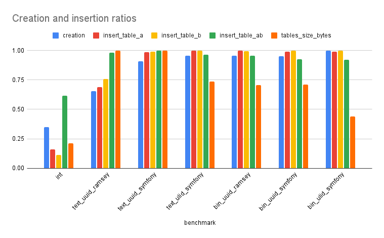
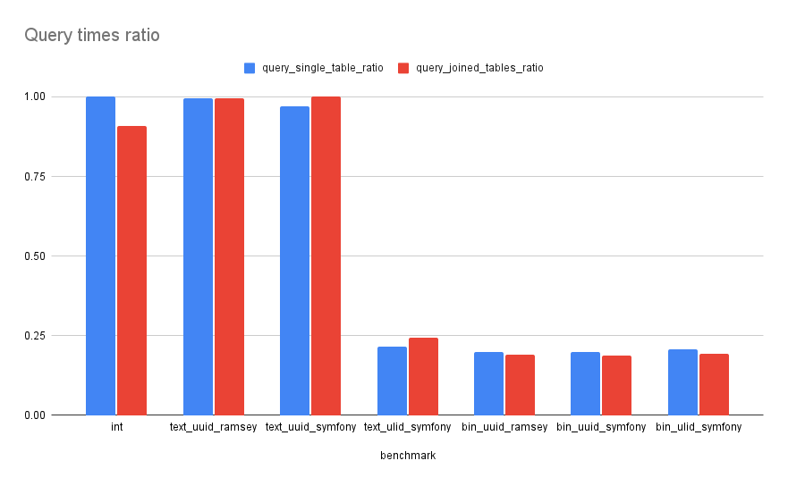

# benchmark-ids
PHP script to benchmark different types of IDs, ie. int, uuid, ulid

## Usefull reading:
- https://github.com/ulid/spec
- https://www.honeybadger.io/blog/uuids-and-ulids/
- https://www.percona.com/blog/2014/12/19/store-uuid-optimized-way/

## Description

This is a script to make a simple, maybe even naive, benchmark of using different types of IDs in MySQL.

Why naive? Because it uses PHP to connect to the MySQL server and run the queries.

How could it be better? We could create stored procedures and run the queries directly in MySQL.

Why wasn't it done that way? Because it would take longer to do the benchmark, and this is good enough.

### What it does:

1. Creates the tables structure A => AB => B. This will allow us to test inserting IDs, and querying on a single table and on the 3 tables joined.
2. Insert IDs in table A.
3. Insert IDs in table B.
4. Insert IDs in table AB.
5. Calculate the tables sizes.
6. Query for each row of table A, by its ID, in random order.
7. Query for each row of table A joined with AB and B, by its ID, in random order.

### Configuration

The configuration is in `bin/run`.

```php
$amountOfRows = 10000;          // Amount of rows inserted in each table of the DB
$amountOfInsertBenchmarks = 3;  // Amount of times to recreate the DB and benchmark the inserts
$amountOfQueryBenchmarks = 100; // Amount of times to run the query benchmarks, which in turn run one per row
```

### How to run

In one console run:
```bash
    make docker-up
```
In another console run:
```bash
    make docker-shell
    make run-all
```

## Results

This benchmark was run on a Dell XPS 13-9370, with no other software sunning, except for the console running the benchmark.

### These were the results:

A spreadsheet with the results can be found [here](https://docs.google.com/spreadsheets/d/1UdHQF-fQRtqm85Q8eQ4-n1MkWAIgnT3srPiHWxwQ38E/edit?usp=sharing).

In all the following graphs, the lower the bars/values, the better.


In this specific graph, it's interesting to note the bar representing the amount of space taken for each of the different ID types.
Furthermore, the comparison must be made between bars of the same color, not cross-color.



As before, in this graph, the comparison must be made between bars of the same color, not cross-color.


## Conclusion

All in all, using a **ULID stored in binary** seems to be the most performant solution:

- Takes less space (2nd graph), losing only to the INT IDs, which we want to remove.
- is faster to insert (1st and 2nd graph), losing only to the text UUID option when inserting to entity tables, but winning when inserting to relation tables (1st graph).
- is faster to query (3rd and 4th graph), winning even to the INT IDs.

It loses on the time to create the tables (4th graph), but the difference is so small that is not even visible in the graph (3rd graph).
